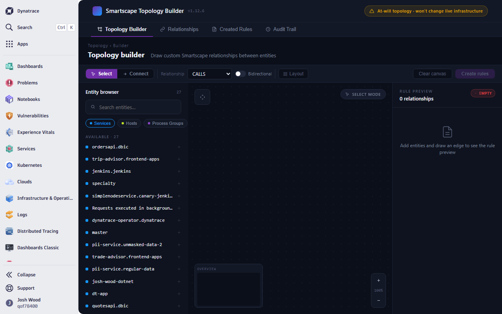
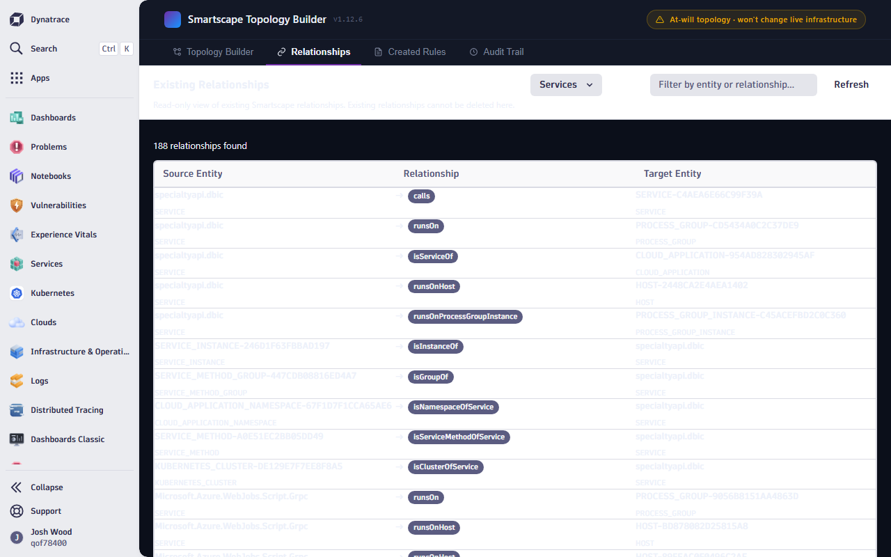
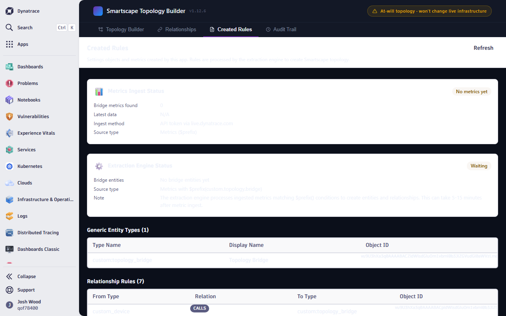
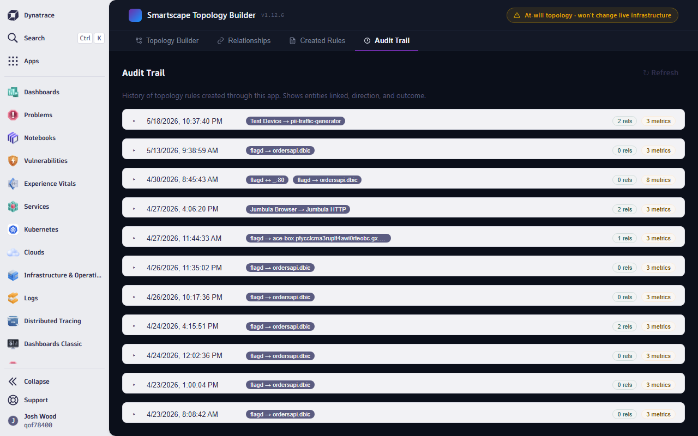

# Smartscape Topology Builder

A Dynatrace App that provides a GUI for creating custom topology rules in Smartscape. Draw edges between any two entities — services, hosts, process groups, custom devices — and the app handles everything needed to make those edges appear in the Smartscape 2.0 service-overview.

**Version**: 1.10.3  
**Platform**: Dynatrace AppEngine (TypeScript/React + Strato Design System)

---

## Quick Start

### Prerequisites

- Node.js 18+
- Access to a Dynatrace SaaS environment (Grail-enabled)
- `dt-app` CLI (bundled via `npx`)

### Authentication & Authorization

This app uses **OAuth 2.0** (Dynatrace Platform identity) — not classic API tokens. When you deploy, the app registers its required scopes with the platform. An environment admin must then **approve the app's permissions** in IAM (Settings → OAuth clients) before it can function.

**Required OAuth scopes** (all declared in `app.config.json`):

| Scope                              | Purpose                               |
| ---------------------------------- | ------------------------------------- |
| `storage:entities:read`            | DQL entity queries                    |
| `environment-api:entities:read`    | Entity API v2 for relationships       |
| `environment-api:entities:write`   | Push bridge entities                  |
| `storage:buckets:read`             | DQL query support                     |
| `storage:events:read`              | DQL entity queries                    |
| `storage:metrics:write`            | Metric ingest for topology extraction |
| `environment-api:metrics:write`    | SDK `metricsClient.ingest()`          |
| `settings:objects:read` / `write`  | Read/write topology settings          |
| `settings:schemas:read`            | Read settings schema definitions      |
| `environment-api:events:write`     | Ingest events for topology extraction |
| `environment-api:api-tokens:write` | Auto-provision fallback API token     |
| `state:app-states:read` / `write`  | Cache token + audit trail             |
| `openTelemetryTrace.ingest`        | OTLP trace ingest for direct edges    |

**No platform token or `dtctl` access is required.** The app runs entirely within the Dynatrace AppEngine runtime and authenticates via the platform's built-in OAuth flow. Users access it through SSO — no separate credentials needed.

> **Note**: If your environment uses the Dynatrace MCP Client or `dtctl`, those are not required for this app. This is a standalone Dynatrace App that only needs IAM scope approval.

### 1. Clone and Install

```bash
git clone https://github.com/josh-wood-dt/smartscape-custom-topology.git
cd smartscape-custom-topology/smartscape-topology-builder
npm install
```

### 2. Configure Your Environment

Edit `app.config.json` and set your environment URL:

```json
{
  "environmentUrl": "https://<your-env-id>.apps.dynatrace.com/"
}
```

### 3. Run Locally

```bash
npm run start
```

This starts the dev server with hot reload and opens the app in your browser.

### 4. Deploy to Dynatrace

```bash
npm run deploy
```

The app will be available at:  
`https://<your-env-id>.apps.dynatrace.com/ui/apps/my.smartscape.topology.builder`

### 5. Create Your First Edge

1. Open the **Topology Builder** tab
2. Use the **Entity Browser** (left sidebar) to filter entities by type (Services, Hosts, Process Groups, etc.)
3. Click entities to place them on the canvas
4. Switch to **Connect** mode (→ Connect button)
5. Click a source entity, then click a target entity to draw an edge
6. Choose a relationship type (calls, runsOn, isServiceOf, etc.)
7. Click **Create Rules** and confirm in the modal
8. Wait 5–15 minutes for Smartscape to process the new topology

---

## Screenshots

### 🗺️ Topology Builder

The main canvas editor. Browse entities by type, place them on the SVG canvas, switch between Select and Connect modes, and draw edges between them.



### 🔗 Relationships

Read-only view of existing Smartscape relationships. Filter by entity type and search by entity or relationship name. Shows directional connections with relationship badges.



### 📋 Created Rules

Audit view of Settings objects and metrics created by the app. Shows metrics ingest status, extraction engine status, registered generic entity types, and relationship definitions.



### 📜 Audit Trail

Execution history log. Every topology creation is recorded with timestamps, edge badges, relationship counts, and metric counts. Entries are expandable for full detail.



---

## What It Does

Smartscape visualizes relationships between monitored entities. Out of the box, these relationships come from OneAgent and OTel instrumentation. This app lets you **create custom topology edges** between any entities that don't have an organic connection — for example, linking a feature-flag service to an API it influences but doesn't directly call.

When you draw an edge in the builder canvas and confirm:

1. **Settings API** — Registers generic entity types and relationship definitions via `builtin:monitoredentities.generic.type` and `builtin:monitoredentities.generic.relation`
2. **Metric Ingest** — Sends bridge metrics (MINT line protocol) that trigger the extraction engine to create a `custom:topology_bridge` entity linking source and target
3. **OTLP Trace Ingest** — Sends binary protobuf CLIENT+SERVER span pairs to create direct SERVICE→SERVICE `calls` edges visible in Smartscape 2.0

The result: your custom edges render in the Smartscape service-overview alongside organic OneAgent/OTel relationships.

---

## Architecture

```
smartscape-topology-builder/
├── app.config.json                     # App ID, version, scopes
├── package.json                        # Dependencies & scripts
├── ui/
│   ├── main.tsx                        # React DOM entry point
│   ├── app/
│   │   ├── App.tsx                     # Router: 4 routes
│   │   ├── types/index.ts             # All interfaces & constants
│   │   ├── api/
│   │   │   ├── topology.ts            # Plan builder + executor (Settings, metrics, traces)
│   │   │   └── audit.ts               # Audit trail persistence (AppState)
│   │   ├── hooks/
│   │   │   ├── useEntities.ts         # DQL entity discovery
│   │   │   └── useRelationships.ts    # Entity API relationship fetch
│   │   ├── components/
│   │   │   ├── Header.tsx             # Navigation tabs
│   │   │   ├── EntityBrowser.tsx      # Entity search sidebar
│   │   │   ├── EntityNodeCard.tsx     # Canvas entity nodes
│   │   │   ├── TopologyCanvas.tsx     # SVG canvas with grid + edge drawing
│   │   │   ├── ConfirmTopologyModal.tsx # Modal with plan preview
│   │   │   └── Card.tsx               # Reusable card component
│   │   └── pages/
│   │       ├── TopologyBuilder.tsx    # Main editor (canvas + entity browser)
│   │       ├── Relationships.tsx      # Read-only relationship viewer
│   │       ├── CreatedRules.tsx       # Settings & metrics audit
│   │       └── AuditTrail.tsx         # Execution history log
├── api/
│   ├── ingest-metrics-v3.function.ts  # Metric ingest (SDK + API token fallback)
│   ├── ingest-topology-trace.function.ts # OTLP binary protobuf trace ingest
│   ├── push-topology.function.ts      # Custom device bridge creation
│   └── ...                            # Legacy function variants
├── docs/
│   └── screenshots/                   # App screenshots for documentation
```

### Data Flow

```
User draws edge on canvas
        │
        ▼
┌─────────────────────┐
│ buildTopologyPlan()  │  Generates Settings defs + metric lines + trace edges
└─────────┬───────────┘
          │
          ▼
┌─────────────────────┐
│   executePlan()      │  4 steps in sequence:
│                      │
│ Step 1: Settings     │─→ builtin:monitoredentities.generic.type
│         (types)      │   (custom:topology_bridge entity type)
│                      │
│ Step 2: Settings     │─→ builtin:monitoredentities.generic.relation
│         (relations)  │   (bridge↔service relationships)
│                      │
│ Step 3: Metrics      │─→ ingest-metrics-v3 function
│                      │   (bridge entity + from/to metrics)
│                      │
│ Step 4: OTLP Trace   │─→ ingest-topology-trace function
│                      │   (CLIENT+SERVER spans → CALLS edge)
└─────────────────────┘
          │
          ▼
    Smartscape 2.0 renders the edge (5-15 min)
```

### Bridge Pattern

Built-in entity types (SERVICE, HOST, etc.) can't have direct custom relationships registered between them. The app solves this with a bridge:

```
SERVICE-A  ←→  CUSTOM_DEVICE (bridge)  ←→  SERVICE-B
```

- **Metric `custom.topology.bridge`** creates the bridge entity
- **Metric `custom.topology.bridge.from`** links source SERVICE → bridge via `dt.entity.service` dimension
- **Metric `custom.topology.bridge.to`** links bridge → target SERVICE via `dt.entity.service` dimension

### OTLP Trace Injection

For the edge to appear in Smartscape 2.0's service-overview (which only renders SERVICE nodes), the app also injects a synthetic distributed trace:

- **CLIENT span** on the source service with `dt.entity.service` resource attribute
- **SERVER span** on the target service with `dt.entity.service` resource attribute
- Same `traceId`, linked by `parentSpanId`
- Encoded as **binary protobuf** (Dynatrace OTLP API does not accept JSON)
- Sent to `https://<env-id>.live.dynatrace.com/api/v2/otlp/v1/traces` with an auto-provisioned API token

The hand-rolled protobuf encoder in `ingest-topology-trace.function.ts` implements the minimal OTLP `ExportTraceServiceRequest` wire format without any external protobuf dependencies.

---

## Key Dependencies

| Package                                        | Purpose                                             |
| ---------------------------------------------- | --------------------------------------------------- |
| `@dynatrace-sdk/react-hooks`                   | `useDql` hook for entity discovery                  |
| `@dynatrace-sdk/client-classic-environment-v2` | Entity API, metrics ingest, API token management    |
| `@dynatrace/strato-components`                 | Flex, Surface, Heading, Text, Button                |
| `@dynatrace/strato-components-preview`         | Page, TitleBar, DataTable, Select, Modal, TextInput |
| `@dynatrace/strato-design-tokens`              | Colors, borders, box-shadows                        |
| `react-router-dom`                             | Client-side routing                                 |

---

## Required Scopes

The app requires 15 scopes in `app.config.json`:

| Scope                              | Purpose                          |
| ---------------------------------- | -------------------------------- |
| `storage:entities:read`            | DQL entity queries               |
| `environment-api:entities:read`    | Entity API for relationships     |
| `environment-api:entities:write`   | Custom device bridge creation    |
| `storage:buckets:read`             | DQL query support                |
| `storage:events:read`              | DQL entity queries               |
| `storage:metrics:write`            | Metric ingest                    |
| `environment-api:metrics:write`    | SDK metricsClient.ingest()       |
| `settings:objects:read`            | Read Settings                    |
| `settings:objects:write`           | Write topology Settings          |
| `settings:schemas:read`            | Read Settings schemas            |
| `environment-api:events:write`     | Event ingest                     |
| `environment-api:api-tokens:write` | Auto-provision API tokens        |
| `state:app-states:read`            | Read cached tokens + audit trail |
| `state:app-states:write`           | Cache tokens + audit trail       |
| `openTelemetryTrace.ingest`        | OTLP trace ingest                |

---

## Troubleshooting

**No edge appearing in Smartscape after 15 minutes?**
- Check the **Created Rules** tab — verify Settings objects exist for the generic type and both relationships
- Check the **Audit Trail** — look for errors in the most recent execution
- Query Grail: `fetch spans | filter contains(toString(span.name), "topology:")` to verify traces landed
- Query Grail: `timeseries avg(custom.topology.bridge)` to verify metrics landed

---

## License

Internal Dynatrace tooling. Not for distribution.
